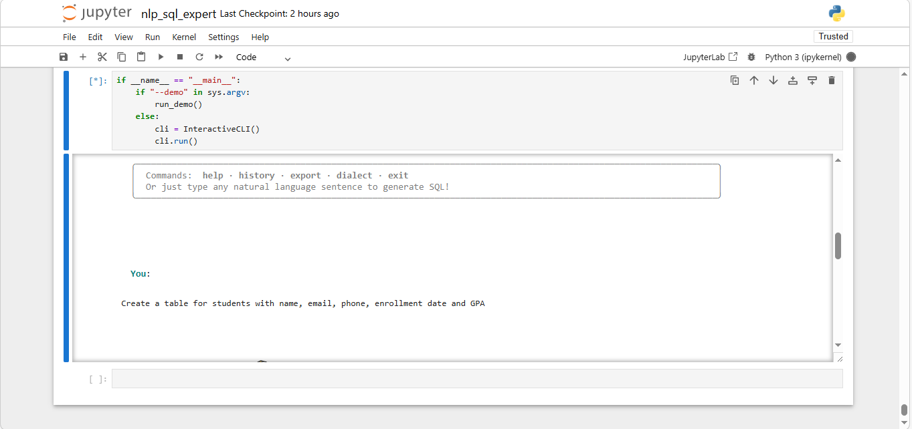
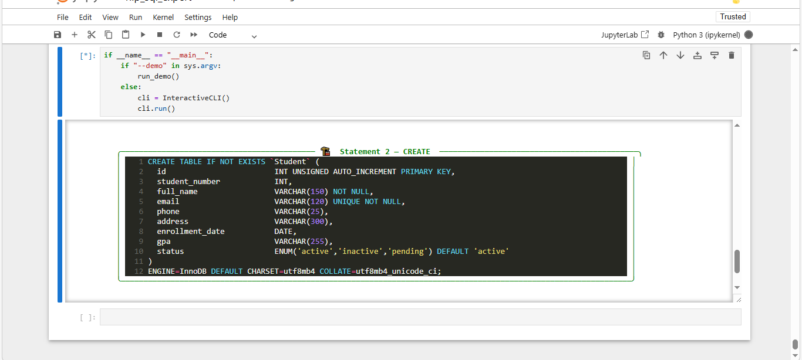

# NLP-SQL-Expert-System
Automated SQL Code Generation Engine via Hybrid NLP &amp; Rule-Based Expert Logic
Technical Overview:
This project is an advanced Code Generation Engine that autonomously synthesizes structured SQL code from natural language descriptions. By leveraging a hybrid architecture of Natural Language Processing (NLP) and Rule-Based Artificial Intelligence, the system transforms ambiguous human intent into production-ready database scripts.

Core Functionality:

Autonomous Code Synthesis: The engine doesn't just map words; it builds the query logic. It determines the correct SQL syntax for different operations (DDL/DML) and handles complex structural requirements like table relationships and data constraints.

Intelligent Schema Drafting: When a user requests a new table, the system uses its internal Expert Knowledge Base to generate a complete schema, including optimized data types (e.g., BIGINT, VARCHAR, TIMESTAMP) and integrity constraints (NOT NULL, UNIQUE, PRIMARY KEY) without manual specification.

Logic-Driven Generation: Utilizing the Rete Algorithm through the Experta engine, the system ensures that the generated code adheres to the strict logical rules of SQL across various dialects (MySQL, PostgreSQL, SQLite).

## 🚀 System Demo

To demonstrate the power of the **Hybrid NLP & Rule-Based Logic**, here is a look at the transformation process from human intent to structured SQL:

| Input (Natural Language) | Output (Synthesized SQL) |
| :---: | :---: |
|  |  |

> **Note:** The engine automatically determines constraints and data types based on the context provided in the input.

